# Master Model Mermaid Diagram v1

## RBI Retail AI Portfolio Intelligence Graph

## 1. Purpose

This diagram shows the reconciled master model across the four demo value stories:

1. Assistant overlap → reusable blueprint
2. Shared tool/service layer across Retail AI agents
3. Governance gap by analogy
4. Scaling blocker propagation

It is a conceptual reference model, not a full implementation schema.

---

## 2. Master Graph Model

```mermaid
graph TD

  %% Group / Strategy / Market Layer
  RBIGroup[RBI Group]
  Strategy[StrategyPillar]
  Bank[NetworkBank]
  Market[Market]

  %% Use Case Context Layer
  UseCase[UseCase]
  User[UserGroup]
  Channel[Channel]
  Process[BusinessProcess]
  KPI[KPI]

  %% Reuse / Technical Layer
  Function[ReusableFunction]
  Tool[ToolServer]
  System[System]
  DataDomain[DataDomain]
  DataProduct[DataProduct]
  Knowledge[KnowledgeBase]

  %% Governance Layer
  Risk[RiskTrigger]
  Control[Control]
  Org[OrgUnit]

  %% Reuse / Scaling Layer
  Blueprint[Blueprint]
  Blocker[Blocker]

  %% Group context
  RBIGroup -->|HAS_STRATEGY| Strategy
  RBIGroup -->|HAS_NETWORK_BANK| Bank
  Bank -->|OPERATES_IN| Market
  Bank -->|HAS_SYSTEM| System

  %% Use case business context
  UseCase -->|IMPLEMENTED_IN| Bank
  UseCase -->|SUPPORTS_STRATEGY| Strategy
  UseCase -->|SERVES| User
  UseCase -->|DELIVERED_THROUGH| Channel
  UseCase -->|SUPPORTS_PROCESS| Process
  UseCase -->|MEASURED_BY| KPI

  %% Reusable function and service layer
  UseCase -->|NEEDS_FUNCTION| Function
  Function -->|DELIVERED_BY| Tool
  Tool -->|USES_SYSTEM| System
  Tool -->|USES_DATA_DOMAIN| DataDomain
  Tool -->|USES_KNOWLEDGE| Knowledge
  Tool -->|REQUIRES_CONTROL| Control
  Tool -->|OWNED_BY| Org

  %% Direct technical / data context
  UseCase -->|USES_SYSTEM| System
  UseCase -->|USES_DATA_DOMAIN| DataDomain
  UseCase -->|USES_KNOWLEDGE| Knowledge
  UseCase -->|REQUIRES_DATA_PRODUCT| DataProduct

  %% Data product layer
  DataProduct -->|COVERS_DATA_DOMAIN| DataDomain
  DataProduct -->|SOURCES_FROM| System
  DataProduct -->|REQUIRES_CONTROL| Control
  DataProduct -->|OWNED_BY| Org

  %% Governance layer
  UseCase -->|HAS_RISK_TRIGGER| Risk
  Risk -->|IMPLIES_CONTROL| Control
  UseCase -->|REQUIRES_CONTROL| Control
  UseCase -->|HAS_COMPLETED_CONTROL| Control
  UseCase -->|MISSING_CONTROL| Control
  UseCase -->|OWNED_BY| Org
  UseCase -->|REVIEWED_BY| Org

  %% Blueprint / reuse layer
  UseCase -->|CANDIDATE_FOR| Blueprint
  UseCase -->|PARTIAL_VARIANT_OF| Blueprint
  Blueprint -->|INCLUDES_FUNCTION| Function
  Blueprint -->|INCLUDES_TOOL_SERVER| Tool
  Blueprint -->|INCLUDES_CONTROL| Control
  Blueprint -->|INCLUDES_CHANNEL_PATTERN| Channel

  %% Blocker propagation layer
  UseCase -->|BLOCKED_BY| Blocker
  Blocker -->|BLOCKS_FUNCTION| Function
  Blocker -->|BLOCKS_TOOL_SERVER| Tool
  Blocker -->|BLOCKS_DATA_PRODUCT| DataProduct
  Blocker -->|BLOCKS_CONTROL| Control
  Blocker -->|AFFECTS_KPI| KPI
  Blocker -->|AFFECTS_BLUEPRINT| Blueprint
  Blocker -->|OWNED_BY| Org

  %% Derived similarity relationships
  UseCase -.->|SIMILAR_FUNCTIONALLY_TO| UseCase
  UseCase -.->|SIMILAR_RISK_TO| UseCase
```



---

## 3. Model Reading Guide

The model is centered on `UseCase`.

Each use case connects to five major contexts:

| Context                    | Key nodes                                                            |
| -------------------------- | -------------------------------------------------------------------- |
| Business context           | `NetworkBank`, `Market`, `StrategyPillar`, `BusinessProcess`, `KPI`  |
| User/channel context       | `UserGroup`, `Channel`                                               |
| Reuse context              | `ReusableFunction`, `Blueprint`                                      |
| Technical context          | `ToolServer`, `System`, `DataDomain`, `DataProduct`, `KnowledgeBase` |
| Governance/scaling context | `RiskTrigger`, `Control`, `OrgUnit`, `Blocker`                       |

---

## 4. Core Model Pattern

The core reusable-function pattern is:

```text
UseCase
  → NEEDS_FUNCTION
ReusableFunction
  → DELIVERED_BY
ToolServer
  → USES_SYSTEM
System
```

Example:

```text
Digital Onboarding Assistant
  → NEEDS_FUNCTION
Check KYC/eKYC status
  → DELIVERED_BY
KYC Status Tool Server
  → USES_SYSTEM
KYC/eKYC Platform
```

---

## 5. Governance Pattern

The governance pattern is:

```text
UseCase
  → HAS_RISK_TRIGGER
RiskTrigger
  → IMPLIES_CONTROL
Control

UseCase
  → HAS_COMPLETED_CONTROL / MISSING_CONTROL
Control
```

Example:

```text
Product Recommendation Assistant
  → HAS_RISK_TRIGGER
Influences product recommendation
  → IMPLIES_CONTROL
Fairness / bias review

Product Recommendation Assistant
  → MISSING_CONTROL
Fairness / bias review
```

---

## 6. Blocker Propagation Pattern

The blocker pattern is:

```text
UseCase
  → BLOCKED_BY
Blocker
  → BLOCKS_FUNCTION / BLOCKS_TOOL_SERVER / BLOCKS_DATA_PRODUCT / BLOCKS_CONTROL
  → AFFECTS_KPI
  → AFFECTS_BLUEPRINT
```

Example:

```text
Digital Onboarding Assistant
  → BLOCKED_BY
KYC/eKYC status API not standardized
  → BLOCKS_FUNCTION
Check KYC/eKYC status
  → AFFECTS_KPI
Digital new-to-bank customers
```

---

## 7. Blueprint Pattern

The blueprint pattern is:

```text
UseCase
  → CANDIDATE_FOR / PARTIAL_VARIANT_OF
Blueprint
  → INCLUDES_FUNCTION
  → INCLUDES_TOOL_SERVER
  → INCLUDES_CONTROL
  → INCLUDES_CHANNEL_PATTERN
```

Example:

```text
Adam TB
  → CANDIDATE_FOR
Retail Conversational Banking Assistant Blueprint

Retail Conversational Banking Assistant Blueprint
  → INCLUDES_FUNCTION
Retrieve product knowledge

Retail Conversational Banking Assistant Blueprint
  → INCLUDES_CONTROL
Content safety
```

---

## 8. Similarity Pattern

Similarity relationships are optional and may be manually seeded or derived.

```text
UseCase
  → SIMILAR_FUNCTIONALLY_TO
UseCase

UseCase
  → SIMILAR_RISK_TO
UseCase
```

Use for:

| Relationship              | Purpose                                 |
| ------------------------- | --------------------------------------- |
| `SIMILAR_FUNCTIONALLY_TO` | Assistant overlap / duplicate detection |
| `SIMILAR_RISK_TO`         | Governance gap by analogy               |

Do not overuse these. They should support specific demo insights only.

---

## 9. Build Priority

For the first prototype, build the model in this order:

1. Reference nodes: `StrategyPillar`, `Market`, `NetworkBank`, `UserGroup`, `Channel`, `BusinessProcess`
2. Core `UseCase` nodes
3. `ReusableFunction`, `ToolServer`, `System`, `KnowledgeBase`, `DataDomain`
4. `RiskTrigger`, `Control`, `OrgUnit`
5. `Blueprint`, `Blocker`, `KPI`, `DataProduct`
6. Relationships for each value story
7. Optional similarity relationships
8. Optional embeddings on `UseCase` and `Blueprint`

---

## 10. Final Modelling Rule

This model should not become a full enterprise architecture graph.

For the prototype, the graph should answer four questions:

1. Which AI use cases overlap enough to form reusable blueprints?
2. Which reusable functions and tool services unlock the most use cases?
3. Which similar-risk use cases have inconsistent governance coverage?
4. Which blockers have the largest downstream strategic impact?
