```mermaid
graph TD

  %% Core use cases
  Adam[UseCase: Adam TB]
  RAIA_K[UseCase: RAIA Kosovo]
  RAIA_B[UseCase: RAIA Bosnia]
  RAIA_C[UseCase: RAIA Croatia]
  Voicebot[UseCase: RBUA/RBCZ Voicebot]
  YellowGPT[UseCase: Product Knowledge yellowGPT]

  %% Banks / markets
  Tatra[NetworkBank: Tatra banka]
  KosovoBank[NetworkBank: Raiffeisen Kosovo]
  BosniaBank[NetworkBank: Raiffeisen Bosnia]
  CroatiaBank[NetworkBank: RBA Croatia]
  AustriaCzech[NetworkBank: RBUA/RBCZ]
  RBIGroup[NetworkBank: RBI Group]

  %% Context
  Customer[UserGroup: Retail customer]
  Staff[UserGroup: Branch/contact-center staff]

  Mobile[Channel: Mobile app]
  Website[Channel: Website]
  InternetBanking[Channel: Internet banking]
  Voice[Channel: Phone / voice]
  InternalGenAI[Channel: Internal GenAI platform]

  Servicing[BusinessProcess: Customer servicing]
  ProductDiscovery[BusinessProcess: Product discovery]
  DigitalSupport[BusinessProcess: Digital banking support]

  Engage[StrategyPillar: Engage]
  Acquire[StrategyPillar: Acquire]
  Monetize[StrategyPillar: Monetize]

  %% Reusable functions
  Intent[ReusableFunction: Identify customer intent]
  ProductKnowledge[ReusableFunction: Retrieve product knowledge]
  DigitalHelp[ReusableFunction: Retrieve digital banking help]
  HumanHandoff[ReusableFunction: Escalate to human]
  Guardrails[ReusableFunction: Apply response guardrails]
  Logging[ReusableFunction: Log interaction]
  CRMLead[ReusableFunction: Create CRM lead]
  StaffAnswer[ReusableFunction: Draft staff answer]

  %% Knowledge / systems
  ProductFAQ[KnowledgeBase: Product FAQ]
  Tariffs[KnowledgeBase: Tariff / Fees Knowledge Base]
  DigitalHelpKB[KnowledgeBase: Digital Banking Help KB]
  ProductPolicy[KnowledgeBase: Product Policy KB]

  MobilePlatform[System: Mobile Banking Platform]
  ContactCenter[System: Contact-Center Platform]
  CRM[System: CRM Platform]
  InternalAI[System: Internal GenAI Platform]

  %% Governance
  CustomerGenAI[RiskTrigger: Customer-facing GenAI]
  AuthChannel[RiskTrigger: Authenticated channel]
  StaffReliance[RiskTrigger: Internal staff reliance on generated answer]

  ContentSafety[Control: Content safety]
  Grounding[Control: Grounded retrieval]
  HandoffControl[Control: Human handoff]
  AuditLogging[Control: Audit logging]
  AuthBoundary[Control: Authentication boundary]

  AICO[OrgUnit: AICO]
  AICoE[OrgUnit: AICoE]
  RetailDigital[OrgUnit: Retail Digital]

  %% Blueprint
  AssistantBP[Blueprint: Retail Conversational Banking Assistant Blueprint]

  %% Implementation
  Adam -->|IMPLEMENTED_IN| Tatra
  RAIA_K -->|IMPLEMENTED_IN| KosovoBank
  RAIA_B -->|IMPLEMENTED_IN| BosniaBank
  RAIA_C -->|IMPLEMENTED_IN| CroatiaBank
  Voicebot -->|IMPLEMENTED_IN| AustriaCzech
  YellowGPT -->|IMPLEMENTED_IN| RBIGroup

  %% Users / channels
  Adam -->|SERVES| Customer
  RAIA_K -->|SERVES| Customer
  RAIA_B -->|SERVES| Customer
  RAIA_C -->|SERVES| Customer
  Voicebot -->|SERVES| Customer
  YellowGPT -->|SERVES| Staff

  Adam -->|DELIVERED_THROUGH| Mobile
  Adam -->|DELIVERED_THROUGH| Website
  Adam -->|DELIVERED_THROUGH| InternetBanking
  RAIA_K -->|DELIVERED_THROUGH| Mobile
  RAIA_K -->|DELIVERED_THROUGH| Website
  RAIA_B -->|DELIVERED_THROUGH| Mobile
  RAIA_C -->|DELIVERED_THROUGH| Website
  Voicebot -->|DELIVERED_THROUGH| Voice
  YellowGPT -->|DELIVERED_THROUGH| InternalGenAI

  %% Business / strategy
  Adam -->|SUPPORTS_PROCESS| Servicing
  RAIA_K -->|SUPPORTS_PROCESS| Servicing
  RAIA_B -->|SUPPORTS_PROCESS| Servicing
  RAIA_C -->|SUPPORTS_PROCESS| ProductDiscovery
  Voicebot -->|SUPPORTS_PROCESS| Servicing
  YellowGPT -->|SUPPORTS_PROCESS| ProductDiscovery

  Adam -->|SUPPORTS_STRATEGY| Engage
  RAIA_K -->|SUPPORTS_STRATEGY| Engage
  RAIA_B -->|SUPPORTS_STRATEGY| Engage
  RAIA_C -->|SUPPORTS_STRATEGY| Engage
  Voicebot -->|SUPPORTS_STRATEGY| Engage
  YellowGPT -->|SUPPORTS_STRATEGY| Monetize

  %% Reusable functions
  Adam -->|NEEDS_FUNCTION| Intent
  Adam -->|NEEDS_FUNCTION| ProductKnowledge
  Adam -->|NEEDS_FUNCTION| DigitalHelp
  Adam -->|NEEDS_FUNCTION| HumanHandoff
  Adam -->|NEEDS_FUNCTION| Guardrails
  Adam -->|NEEDS_FUNCTION| Logging

  RAIA_K -->|NEEDS_FUNCTION| Intent
  RAIA_K -->|NEEDS_FUNCTION| ProductKnowledge
  RAIA_K -->|NEEDS_FUNCTION| DigitalHelp
  RAIA_K -->|NEEDS_FUNCTION| Guardrails
  RAIA_K -->|NEEDS_FUNCTION| Logging

  RAIA_B -->|NEEDS_FUNCTION| ProductKnowledge
  RAIA_B -->|NEEDS_FUNCTION| DigitalHelp
  RAIA_B -->|NEEDS_FUNCTION| HumanHandoff
  RAIA_B -->|NEEDS_FUNCTION| Guardrails
  RAIA_B -->|NEEDS_FUNCTION| Logging

  RAIA_C -->|NEEDS_FUNCTION| ProductKnowledge
  RAIA_C -->|NEEDS_FUNCTION| DigitalHelp
  RAIA_C -->|NEEDS_FUNCTION| Guardrails
  RAIA_C -->|NEEDS_FUNCTION| Logging

  Voicebot -->|NEEDS_FUNCTION| Intent
  Voicebot -->|NEEDS_FUNCTION| HumanHandoff
  Voicebot -->|NEEDS_FUNCTION| Logging

  YellowGPT -->|NEEDS_FUNCTION| ProductKnowledge
  YellowGPT -->|NEEDS_FUNCTION| StaffAnswer
  YellowGPT -->|NEEDS_FUNCTION| Guardrails

  %% Knowledge / systems
  Adam -->|USES_KNOWLEDGE| ProductFAQ
  Adam -->|USES_KNOWLEDGE| DigitalHelpKB
  RAIA_K -->|USES_KNOWLEDGE| ProductFAQ
  RAIA_B -->|USES_KNOWLEDGE| ProductFAQ
  RAIA_C -->|USES_KNOWLEDGE| ProductFAQ
  YellowGPT -->|USES_KNOWLEDGE| ProductPolicy
  YellowGPT -->|USES_KNOWLEDGE| Tariffs

  Adam -->|USES_SYSTEM| MobilePlatform
  RAIA_K -->|USES_SYSTEM| MobilePlatform
  RAIA_B -->|USES_SYSTEM| MobilePlatform
  Voicebot -->|USES_SYSTEM| ContactCenter
  Adam -->|USES_SYSTEM| CRM
  YellowGPT -->|USES_SYSTEM| InternalAI

  %% Governance
  Adam -->|HAS_RISK_TRIGGER| CustomerGenAI
  RAIA_K -->|HAS_RISK_TRIGGER| CustomerGenAI
  RAIA_B -->|HAS_RISK_TRIGGER| CustomerGenAI
  RAIA_C -->|HAS_RISK_TRIGGER| CustomerGenAI
  Adam -->|HAS_RISK_TRIGGER| AuthChannel
  YellowGPT -->|HAS_RISK_TRIGGER| StaffReliance

  CustomerGenAI -->|IMPLIES_CONTROL| ContentSafety
  CustomerGenAI -->|IMPLIES_CONTROL| Grounding
  AuthChannel -->|IMPLIES_CONTROL| AuthBoundary
  StaffReliance -->|IMPLIES_CONTROL| Grounding

  Adam -->|REQUIRES_CONTROL| ContentSafety
  Adam -->|REQUIRES_CONTROL| Grounding
  Adam -->|REQUIRES_CONTROL| AuditLogging
  RAIA_K -->|REQUIRES_CONTROL| ContentSafety
  RAIA_B -->|REQUIRES_CONTROL| ContentSafety
  Voicebot -->|REQUIRES_CONTROL| HandoffControl
  YellowGPT -->|REQUIRES_CONTROL| Grounding

  Adam -->|REVIEWED_BY| AICO
  RAIA_K -->|REVIEWED_BY| AICoE
  Voicebot -->|REVIEWED_BY| RetailDigital

  %% Blueprint fit
  Adam -->|CANDIDATE_FOR| AssistantBP
  RAIA_K -->|CANDIDATE_FOR| AssistantBP
  RAIA_B -->|CANDIDATE_FOR| AssistantBP
  RAIA_C -->|CANDIDATE_FOR| AssistantBP
  Voicebot -->|PARTIAL_VARIANT_OF| AssistantBP
  YellowGPT -->|PARTIAL_VARIANT_OF| AssistantBP

  AssistantBP -->|INCLUDES_FUNCTION| Intent
  AssistantBP -->|INCLUDES_FUNCTION| ProductKnowledge
  AssistantBP -->|INCLUDES_FUNCTION| HumanHandoff
  AssistantBP -->|INCLUDES_FUNCTION| Guardrails
  AssistantBP -->|INCLUDES_FUNCTION| Logging
  AssistantBP -->|INCLUDES_CONTROL| ContentSafety
  AssistantBP -->|INCLUDES_CONTROL| Grounding
  AssistantBP -->|INCLUDES_CONTROL| AuditLogging
  AssistantBP -->|INCLUDES_CHANNEL_PATTERN| Mobile
  AssistantBP -->|INCLUDES_CHANNEL_PATTERN| Website
  AssistantBP -->|INCLUDES_CHANNEL_PATTERN| Voice

  %% Similarity
  Adam -.->|SIMILAR_FUNCTIONALLY_TO| RAIA_K
  RAIA_K -.->|SIMILAR_FUNCTIONALLY_TO| RAIA_B
  RAIA_B -.->|SIMILAR_FUNCTIONALLY_TO| RAIA_C
```

```mermaid
graph TD

  %% Use cases
  Onboarding[UseCase: Digital Onboarding Assistant]
  AuthAssistant[UseCase: Authenticated Customer Assistant]
  BranchCopilot[UseCase: Branch Advisor Copilot]
  SalesAssistant[UseCase: Sales / Offer Assistant]
  ComplaintTriage[UseCase: Complaint Triage Assistant]
  FAQ[UseCase: Public FAQ Assistant]

  %% Users / processes / strategy
  Prospect[UserGroup: Prospect]
  Customer[UserGroup: Retail customer]
  BranchAdvisor[UserGroup: Branch advisor]
  CampaignManager[UserGroup: Campaign manager]
  ContactAgent[UserGroup: Contact-center agent]

  Acquire[StrategyPillar: Acquire]
  Engage[StrategyPillar: Engage]
  Monetize[StrategyPillar: Monetize]

  DigitalOnboarding[BusinessProcess: Digital onboarding]
  Servicing[BusinessProcess: Customer servicing]
  BranchAdvisory[BusinessProcess: Branch advisory]
  LeadGeneration[BusinessProcess: Lead generation]
  ComplaintHandling[BusinessProcess: Complaint handling]

  %% Reusable functions
  CustomerProfile[ReusableFunction: Retrieve customer profile]
  KYCStatus[ReusableFunction: Check KYC/eKYC status]
  Eligibility[ReusableFunction: Check product eligibility]
  ProductKnowledge[ReusableFunction: Retrieve product knowledge]
  CRMLead[ReusableFunction: Create CRM lead]
  ConsentStatus[ReusableFunction: Retrieve consent status]
  HumanHandoff[ReusableFunction: Escalate to human]
  ComplaintClassify[ReusableFunction: Classify complaint/service request]
  InteractionLog[ReusableFunction: Log interaction]

  %% Tool servers
  CustomerProfileTool[ToolServer: Customer Profile Tool Server]
  KYCTool[ToolServer: KYC Status Tool Server]
  EligibilityTool[ToolServer: Product Eligibility Tool Server]
  ProductKnowledgeTool[ToolServer: Product Knowledge Retrieval Service]
  CRMLeadTool[ToolServer: CRM Lead Tool Server]
  ConsentTool[ToolServer: Consent Status Tool Server]
  HandoffTool[ToolServer: Human Handoff Tool Server]
  ComplaintTool[ToolServer: Complaint Classification Service]
  AuditTool[ToolServer: Audit Logging Tool Server]

  %% Systems
  CustomerMaster[System: Customer Master]
  KYCSystem[System: KYC/eKYC Platform]
  ProductCatalogue[System: Product Catalogue]
  EligibilityRules[System: Eligibility Rules Engine]
  CRM[System: CRM / Campaign Platform]
  ConsentSystem[System: Consent Management System]
  ContactCenter[System: Contact-Center Platform]
  MobileBanking[System: Mobile Banking Platform]

  %% Data domains
  CustomerData[DataDomain: Customer profile]
  KYCData[DataDomain: KYC / identity verification]
  ProductData[DataDomain: Product catalogue]
  CRMData[DataDomain: CRM interactions]
  ConsentData[DataDomain: Consent]
  ComplaintData[DataDomain: Complaint history]
  AuditData[DataDomain: Audit / interaction logs]

  %% Controls / org
  RBAC[Control: Role-based access control]
  APIAccess[Control: API access control]
  AuditLogging[Control: Audit logging]
  ConsentCheck[Control: Consent check]
  HumanOversight[Control: Human oversight]
  ReadWriteSeparation[Control: Read/write action separation]

  APITeam[OrgUnit: CIO / API Team]
  DataOffice[OrgUnit: Data Office]
  AICoE[OrgUnit: AICoE]
  CRMTeam[OrgUnit: CRM / CVM Team]

  %% Blueprint
  ToolingBP[Blueprint: Retail Agent Tooling Blueprint]

  %% Use case context
  Onboarding -->|SERVES| Prospect
  AuthAssistant -->|SERVES| Customer
  BranchCopilot -->|SERVES| BranchAdvisor
  SalesAssistant -->|SERVES| CampaignManager
  ComplaintTriage -->|SERVES| ContactAgent
  FAQ -->|SERVES| Customer

  Onboarding -->|SUPPORTS_STRATEGY| Acquire
  AuthAssistant -->|SUPPORTS_STRATEGY| Engage
  BranchCopilot -->|SUPPORTS_STRATEGY| Engage
  BranchCopilot -->|SUPPORTS_STRATEGY| Monetize
  SalesAssistant -->|SUPPORTS_STRATEGY| Monetize
  ComplaintTriage -->|SUPPORTS_STRATEGY| Engage
  FAQ -->|SUPPORTS_STRATEGY| Engage

  Onboarding -->|SUPPORTS_PROCESS| DigitalOnboarding
  AuthAssistant -->|SUPPORTS_PROCESS| Servicing
  BranchCopilot -->|SUPPORTS_PROCESS| BranchAdvisory
  SalesAssistant -->|SUPPORTS_PROCESS| LeadGeneration
  ComplaintTriage -->|SUPPORTS_PROCESS| ComplaintHandling

  %% Functions needed
  Onboarding -->|NEEDS_FUNCTION| KYCStatus
  Onboarding -->|NEEDS_FUNCTION| ProductKnowledge
  Onboarding -->|NEEDS_FUNCTION| InteractionLog

  AuthAssistant -->|NEEDS_FUNCTION| CustomerProfile
  AuthAssistant -->|NEEDS_FUNCTION| ProductKnowledge
  AuthAssistant -->|NEEDS_FUNCTION| HumanHandoff
  AuthAssistant -->|NEEDS_FUNCTION| InteractionLog

  BranchCopilot -->|NEEDS_FUNCTION| CustomerProfile
  BranchCopilot -->|NEEDS_FUNCTION| Eligibility
  BranchCopilot -->|NEEDS_FUNCTION| ProductKnowledge
  BranchCopilot -->|NEEDS_FUNCTION| CRMLead

  SalesAssistant -->|NEEDS_FUNCTION| CustomerProfile
  SalesAssistant -->|NEEDS_FUNCTION| Eligibility
  SalesAssistant -->|NEEDS_FUNCTION| CRMLead
  SalesAssistant -->|NEEDS_FUNCTION| ConsentStatus

  ComplaintTriage -->|NEEDS_FUNCTION| ComplaintClassify
  ComplaintTriage -->|NEEDS_FUNCTION| HumanHandoff
  ComplaintTriage -->|NEEDS_FUNCTION| InteractionLog

  FAQ -->|NEEDS_FUNCTION| ProductKnowledge

  %% Function to tools
  CustomerProfile -->|DELIVERED_BY| CustomerProfileTool
  KYCStatus -->|DELIVERED_BY| KYCTool
  Eligibility -->|DELIVERED_BY| EligibilityTool
  ProductKnowledge -->|DELIVERED_BY| ProductKnowledgeTool
  CRMLead -->|DELIVERED_BY| CRMLeadTool
  ConsentStatus -->|DELIVERED_BY| ConsentTool
  HumanHandoff -->|DELIVERED_BY| HandoffTool
  ComplaintClassify -->|DELIVERED_BY| ComplaintTool
  InteractionLog -->|DELIVERED_BY| AuditTool

  %% Tools to systems
  CustomerProfileTool -->|USES_SYSTEM| CustomerMaster
  KYCTool -->|USES_SYSTEM| KYCSystem
  EligibilityTool -->|USES_SYSTEM| ProductCatalogue
  EligibilityTool -->|USES_SYSTEM| EligibilityRules
  CRMLeadTool -->|USES_SYSTEM| CRM
  ConsentTool -->|USES_SYSTEM| ConsentSystem
  HandoffTool -->|USES_SYSTEM| ContactCenter
  ComplaintTool -->|USES_SYSTEM| ContactCenter
  AuditTool -->|USES_SYSTEM| MobileBanking

  %% Tools to data
  CustomerProfileTool -->|USES_DATA_DOMAIN| CustomerData
  KYCTool -->|USES_DATA_DOMAIN| KYCData
  EligibilityTool -->|USES_DATA_DOMAIN| ProductData
  CRMLeadTool -->|USES_DATA_DOMAIN| CRMData
  ConsentTool -->|USES_DATA_DOMAIN| ConsentData
  ComplaintTool -->|USES_DATA_DOMAIN| ComplaintData
  AuditTool -->|USES_DATA_DOMAIN| AuditData

  %% Controls
  CustomerProfileTool -->|REQUIRES_CONTROL| RBAC
  KYCTool -->|REQUIRES_CONTROL| RBAC
  KYCTool -->|REQUIRES_CONTROL| AuditLogging
  CRMLeadTool -->|REQUIRES_CONTROL| ReadWriteSeparation
  CRMLeadTool -->|REQUIRES_CONTROL| AuditLogging
  ConsentTool -->|REQUIRES_CONTROL| ConsentCheck
  ComplaintTool -->|REQUIRES_CONTROL| HumanOversight
  AuditTool -->|REQUIRES_CONTROL| AuditLogging

  %% Ownership
  CustomerProfileTool -->|OWNED_BY| APITeam
  KYCTool -->|OWNED_BY| APITeam
  EligibilityTool -->|OWNED_BY| APITeam
  CRMLeadTool -->|OWNED_BY| CRMTeam
  ConsentTool -->|OWNED_BY| DataOffice
  ProductKnowledgeTool -->|OWNED_BY| AICoE

  %% Blueprint
  Onboarding -->|CANDIDATE_FOR| ToolingBP
  AuthAssistant -->|CANDIDATE_FOR| ToolingBP
  BranchCopilot -->|CANDIDATE_FOR| ToolingBP
  SalesAssistant -->|CANDIDATE_FOR| ToolingBP

  ToolingBP -->|INCLUDES_FUNCTION| CustomerProfile
  ToolingBP -->|INCLUDES_FUNCTION| KYCStatus
  ToolingBP -->|INCLUDES_FUNCTION| Eligibility
  ToolingBP -->|INCLUDES_FUNCTION| CRMLead
  ToolingBP -->|INCLUDES_FUNCTION| ProductKnowledge
  ToolingBP -->|INCLUDES_TOOL_SERVER| CustomerProfileTool
  ToolingBP -->|INCLUDES_TOOL_SERVER| KYCTool
  ToolingBP -->|INCLUDES_TOOL_SERVER| EligibilityTool
  ToolingBP -->|INCLUDES_TOOL_SERVER| CRMLeadTool
  ToolingBP -->|INCLUDES_CONTROL| RBAC
  ToolingBP -->|INCLUDES_CONTROL| AuditLogging
  ToolingBP -->|INCLUDES_CONTROL| ReadWriteSeparation
```

```mermaid
graph TD

  %% Use cases
  OfferEngine[UseCase: Personalized Offer Engine]
  ProductRec[UseCase: Product Recommendation Assistant]
  LoanAfford[UseCase: Loan Affordability Recommender]
  CreditPre[UseCase: Credit Pre-Approval Assistant]
  AuthAssistant[UseCase: Authenticated Mobile Banking Assistant]
  PublicFAQ[UseCase: Public FAQ Assistant]
  ComplaintTriage[UseCase: Complaint Triage Assistant]

  %% Context
  Customer[UserGroup: Retail customer]
  Advisor[UserGroup: Advisor]
  CampaignTeam[UserGroup: Campaign team]
  ContactAgent[UserGroup: Contact-center agent]

  Mobile[Channel: Mobile app]
  CRM[Channel: CRM / Campaign Platform]
  StaffPortal[Channel: Staff portal]
  Website[Channel: Website]
  ContactCenter[Channel: Contact-center platform]

  Monetize[StrategyPillar: Monetize]
  Engage[StrategyPillar: Engage]
  Acquire[StrategyPillar: Acquire]

  ProductRecommendation[BusinessProcess: Product recommendation]
  CreditAssessment[BusinessProcess: Credit pre-assessment]
  CustomerServicing[BusinessProcess: Customer servicing]
  ComplaintHandling[BusinessProcess: Complaint handling]

  %% Data domains
  CustomerData[DataDomain: Customer profile]
  BehaviourData[DataDomain: Behavioural / CRM data]
  TransactionData[DataDomain: Transaction summary]
  ComplaintData[DataDomain: Complaint history]
  ProductData[DataDomain: Product catalogue]

  %% Risk triggers
  PersonalData[RiskTrigger: Uses personal data]
  BehaviouralData[RiskTrigger: Uses behavioural data]
  TransactionUse[RiskTrigger: Uses transaction data]
  AuthChannel[RiskTrigger: Operates in authenticated channel]
  CustomerFacing[RiskTrigger: Customer-facing AI output]
  ProductChoice[RiskTrigger: Influences product recommendation]
  CreditAdjacent[RiskTrigger: Credit-adjacent recommendation]
  ComplaintSensitive[RiskTrigger: Uses complaint data]

  %% Controls
  AICOReview[Control: AICO review]
  AICoEReview[Control: AICoE technical review]
  GDPRReview[Control: GDPR review]
  DataMin[Control: Data minimization]
  HumanOversight[Control: Human oversight]
  Explainability[Control: Explainability]
  Fairness[Control: Fairness / bias review]
  ModelValidation[Control: Model validation]
  OutputGrounding[Control: Output grounding]
  ContentSafety[Control: Content safety]
  AuditLogging[Control: Audit logging]
  AccessControl[Control: Access control]

  %% Org units
  AICO[OrgUnit: AICO]
  AICoE[OrgUnit: AICoE]
  Compliance[OrgUnit: Legal & Compliance]
  ModelRisk[OrgUnit: Model Risk]
  CRMTeam[OrgUnit: CRM / CVM Team]
  RetailCredit[OrgUnit: Retail Credit Team]
  ContactOps[OrgUnit: Contact Center Operations]

  %% Blueprint
  GovPattern[Blueprint: Customer-Facing AI Governance Pattern]

  %% Use case context
  OfferEngine -->|SERVES| CampaignTeam
  OfferEngine -->|SERVES| Customer
  ProductRec -->|SERVES| Customer
  LoanAfford -->|SERVES| Advisor
  LoanAfford -->|SERVES| Customer
  CreditPre -->|SERVES| Advisor
  AuthAssistant -->|SERVES| Customer
  PublicFAQ -->|SERVES| Customer
  ComplaintTriage -->|SERVES| ContactAgent

  OfferEngine -->|DELIVERED_THROUGH| CRM
  ProductRec -->|DELIVERED_THROUGH| Mobile
  LoanAfford -->|DELIVERED_THROUGH| StaffPortal
  CreditPre -->|DELIVERED_THROUGH| StaffPortal
  AuthAssistant -->|DELIVERED_THROUGH| Mobile
  PublicFAQ -->|DELIVERED_THROUGH| Website
  ComplaintTriage -->|DELIVERED_THROUGH| ContactCenter

  OfferEngine -->|SUPPORTS_STRATEGY| Monetize
  ProductRec -->|SUPPORTS_STRATEGY| Monetize
  LoanAfford -->|SUPPORTS_STRATEGY| Acquire
  CreditPre -->|SUPPORTS_STRATEGY| Acquire
  AuthAssistant -->|SUPPORTS_STRATEGY| Engage
  PublicFAQ -->|SUPPORTS_STRATEGY| Engage
  ComplaintTriage -->|SUPPORTS_STRATEGY| Engage

  OfferEngine -->|SUPPORTS_PROCESS| ProductRecommendation
  ProductRec -->|SUPPORTS_PROCESS| ProductRecommendation
  LoanAfford -->|SUPPORTS_PROCESS| CreditAssessment
  CreditPre -->|SUPPORTS_PROCESS| CreditAssessment
  AuthAssistant -->|SUPPORTS_PROCESS| CustomerServicing
  PublicFAQ -->|SUPPORTS_PROCESS| CustomerServicing
  ComplaintTriage -->|SUPPORTS_PROCESS| ComplaintHandling

  %% Data dependencies
  OfferEngine -->|USES_DATA_DOMAIN| CustomerData
  OfferEngine -->|USES_DATA_DOMAIN| BehaviourData
  ProductRec -->|USES_DATA_DOMAIN| CustomerData
  ProductRec -->|USES_DATA_DOMAIN| BehaviourData
  LoanAfford -->|USES_DATA_DOMAIN| TransactionData
  LoanAfford -->|USES_DATA_DOMAIN| CustomerData
  CreditPre -->|USES_DATA_DOMAIN| TransactionData
  CreditPre -->|USES_DATA_DOMAIN| CustomerData
  AuthAssistant -->|USES_DATA_DOMAIN| CustomerData
  PublicFAQ -->|USES_DATA_DOMAIN| ProductData
  ComplaintTriage -->|USES_DATA_DOMAIN| ComplaintData

  %% Risk triggers
  OfferEngine -->|HAS_RISK_TRIGGER| PersonalData
  OfferEngine -->|HAS_RISK_TRIGGER| BehaviouralData
  OfferEngine -->|HAS_RISK_TRIGGER| ProductChoice

  ProductRec -->|HAS_RISK_TRIGGER| PersonalData
  ProductRec -->|HAS_RISK_TRIGGER| BehaviouralData
  ProductRec -->|HAS_RISK_TRIGGER| ProductChoice

  LoanAfford -->|HAS_RISK_TRIGGER| TransactionUse
  LoanAfford -->|HAS_RISK_TRIGGER| CreditAdjacent

  CreditPre -->|HAS_RISK_TRIGGER| TransactionUse
  CreditPre -->|HAS_RISK_TRIGGER| CreditAdjacent

  AuthAssistant -->|HAS_RISK_TRIGGER| AuthChannel
  AuthAssistant -->|HAS_RISK_TRIGGER| CustomerFacing
  AuthAssistant -->|HAS_RISK_TRIGGER| PersonalData

  PublicFAQ -->|HAS_RISK_TRIGGER| CustomerFacing

  ComplaintTriage -->|HAS_RISK_TRIGGER| ComplaintSensitive
  ComplaintTriage -->|HAS_RISK_TRIGGER| PersonalData

  %% Trigger to controls
  PersonalData -->|IMPLIES_CONTROL| GDPRReview
  PersonalData -->|IMPLIES_CONTROL| DataMin
  BehaviouralData -->|IMPLIES_CONTROL| Fairness
  ProductChoice -->|IMPLIES_CONTROL| Explainability
  ProductChoice -->|IMPLIES_CONTROL| HumanOversight
  CreditAdjacent -->|IMPLIES_CONTROL| ModelValidation
  CreditAdjacent -->|IMPLIES_CONTROL| HumanOversight
  CustomerFacing -->|IMPLIES_CONTROL| ContentSafety
  CustomerFacing -->|IMPLIES_CONTROL| OutputGrounding
  AuthChannel -->|IMPLIES_CONTROL| AccessControl
  AuthChannel -->|IMPLIES_CONTROL| AuditLogging
  ComplaintSensitive -->|IMPLIES_CONTROL| GDPRReview

  %% Completed controls
  OfferEngine -->|HAS_COMPLETED_CONTROL| GDPRReview
  OfferEngine -->|HAS_COMPLETED_CONTROL| Fairness
  OfferEngine -->|HAS_COMPLETED_CONTROL| Explainability
  OfferEngine -->|REVIEWED_BY| AICO

  CreditPre -->|HAS_COMPLETED_CONTROL| ModelValidation
  CreditPre -->|HAS_COMPLETED_CONTROL| HumanOversight
  CreditPre -->|REVIEWED_BY| ModelRisk
  CreditPre -->|REVIEWED_BY| AICO

  PublicFAQ -->|HAS_COMPLETED_CONTROL| OutputGrounding
  PublicFAQ -->|HAS_COMPLETED_CONTROL| ContentSafety

  %% Missing controls
  ProductRec -->|MISSING_CONTROL| Fairness
  ProductRec -->|MISSING_CONTROL| Explainability
  ProductRec -->|MISSING_CONTROL| GDPRReview

  LoanAfford -->|MISSING_CONTROL| ModelValidation
  LoanAfford -->|MISSING_CONTROL| HumanOversight

  AuthAssistant -->|MISSING_CONTROL| AuditLogging
  AuthAssistant -->|MISSING_CONTROL| AccessControl

  ComplaintTriage -->|MISSING_CONTROL| GDPRReview
  ComplaintTriage -->|MISSING_CONTROL| DataMin

  %% Ownership
  OfferEngine -->|OWNED_BY| CRMTeam
  ProductRec -->|OWNED_BY| CRMTeam
  LoanAfford -->|OWNED_BY| RetailCredit
  CreditPre -->|OWNED_BY| RetailCredit
  ComplaintTriage -->|OWNED_BY| ContactOps

  %% Similarity
  ProductRec -.->|SIMILAR_RISK_TO| OfferEngine
  LoanAfford -.->|SIMILAR_RISK_TO| CreditPre
  AuthAssistant -.->|SIMILAR_RISK_TO| PublicFAQ

  %% Governance pattern
  OfferEngine -->|CANDIDATE_FOR| GovPattern
  ProductRec -->|CANDIDATE_FOR| GovPattern
  LoanAfford -->|CANDIDATE_FOR| GovPattern
  AuthAssistant -->|CANDIDATE_FOR| GovPattern

  GovPattern -->|INCLUDES_CONTROL| AICOReview
  GovPattern -->|INCLUDES_CONTROL| GDPRReview
  GovPattern -->|INCLUDES_CONTROL| AuditLogging
  GovPattern -->|INCLUDES_CONTROL| HumanOversight
  GovPattern -->|INCLUDES_CONTROL| Fairness
  GovPattern -->|INCLUDES_CONTROL| Explainability
```

```mermaid
graph TD

  %% Use cases
  Onboarding[UseCase: Digital Onboarding Assistant]
  EAccount[UseCase: eAccount Opening Assistant]
  AuthAssistant[UseCase: Authenticated Customer Assistant]
  OfferEngine[UseCase: Personalized Offer Engine]
  BranchCopilot[UseCase: Branch Advisor Copilot]
  ComplaintTriage[UseCase: Complaint Triage Assistant]
  CRMLeadAssistant[UseCase: CRM Lead Assistant]

  %% Strategy / process / KPI
  Acquire[StrategyPillar: Acquire]
  Engage[StrategyPillar: Engage]
  Monetize[StrategyPillar: Monetize]

  DigitalOnboarding[BusinessProcess: Digital onboarding]
  EAccountOpening[BusinessProcess: eAccount opening]
  CustomerService[BusinessProcess: Authenticated customer service]
  OfferProcess[BusinessProcess: Campaign execution]
  BranchAdvisory[BusinessProcess: Branch advisory]
  ComplaintHandling[BusinessProcess: Complaint handling]
  LeadGeneration[BusinessProcess: Lead generation]

  DigitalNTB[KPI: Digital new-to-bank customers]
  OnboardingCompletion[KPI: Onboarding completion rate]
  MobileEngagement[KPI: Mobile engagement]
  DigitalSales[KPI: Digital sales conversion]
  LeadConversion[KPI: Lead conversion rate]
  ComplaintTime[KPI: Complaint handling time]
  GovReadiness[KPI: Governance readiness score]
  ReuseCount[KPI: Reuse count]

  %% Functions
  KYCStatus[ReusableFunction: Check KYC/eKYC status]
  CustomerProfile[ReusableFunction: Retrieve customer profile]
  ProductEligibility[ReusableFunction: Check product eligibility]
  CRMLead[ReusableFunction: Create CRM lead]
  ConsentStatus[ReusableFunction: Retrieve consent status]
  AuditLog[ReusableFunction: Log interaction]
  ComplaintHistory[ReusableFunction: Retrieve complaint history]

  %% Tool servers
  KYCTool[ToolServer: KYC Status Tool Server]
  CustomerProfileTool[ToolServer: Customer Profile Tool Server]
  EligibilityTool[ToolServer: Product Eligibility Tool Server]
  CRMLeadTool[ToolServer: CRM Lead Tool Server]
  ConsentTool[ToolServer: Consent Status Tool Server]
  AuditTool[ToolServer: Audit Logging Tool Server]
  ComplaintTool[ToolServer: Complaint History Tool Server]

  %% Systems
  KYCSystem[System: KYC/eKYC Platform]
  CustomerMaster[System: Customer Master]
  ProductCatalogue[System: Product Catalogue]
  EligibilityRules[System: Eligibility Rules Engine]
  CRM[System: CRM / Campaign Platform]
  ConsentSystem[System: Consent Management System]
  ContactCenter[System: Contact-Center Platform]
  DataPlatform[System: Data Platform / APEX-like Environment]

  %% Data products
  Customer360[DataProduct: Customer 360 Data Product]
  ConsentDP[DataProduct: Consent Data Product]
  KYCDataProduct[DataProduct: KYC Status Data Product]
  CRMInteractionDP[DataProduct: CRM Interaction Data Product]

  %% Data domains
  CustomerData[DataDomain: Customer profile]
  KYCData[DataDomain: KYC / identity verification]
  ConsentData[DataDomain: Consent]
  CRMData[DataDomain: CRM interactions]
  ComplaintData[DataDomain: Complaint history]

  %% Controls
  AccessControl[Control: Role-based access control]
  AuditLogging[Control: Audit logging]
  DataLineage[Control: Data lineage]
  ConsentCheck[Control: Consent check]
  AICOReview[Control: AICO review]
  RetentionControl[Control: Complaint data retention control]
  ReadWriteSeparation[Control: Read/write action separation]

  %% Blockers
  BLK_KYC[Blocker: KYC/eKYC status API not standardized]
  BLK_Profile[Blocker: Customer profile access not approved]
  BLK_Eligibility[Blocker: Product eligibility logic fragmented]
  BLK_CRM[Blocker: CRM lead creation API not reusable]
  BLK_Consent[Blocker: Consent data product incomplete]
  BLK_Audit[Blocker: Missing audit logging pattern]
  BLK_Lineage[Blocker: Incomplete lineage for customer data product]
  BLK_Complaint[Blocker: Complaint data retention control missing]
  BLK_AICO[Blocker: AICO review not completed]

  %% Org units
  APITeam[OrgUnit: CIO / API Team]
  DataOffice[OrgUnit: Data Office]
  AICO[OrgUnit: AICO]
  CRMTeam[OrgUnit: CRM / CVM Team]
  ContactOps[OrgUnit: Contact Center Operations]

  %% Blueprints
  OnboardingBP[Blueprint: Digital Onboarding Assistant Blueprint]
  ToolingBP[Blueprint: Retail Agent Tooling Blueprint]
  AssistantBP[Blueprint: Retail Conversational Banking Assistant Blueprint]
  OfferGovBP[Blueprint: Personalized Offer Governance Pattern]
  ComplaintBP[Blueprint: Complaint AI Pattern]

  %% Use case strategy/process/KPI
  Onboarding -->|SUPPORTS_STRATEGY| Acquire
  EAccount -->|SUPPORTS_STRATEGY| Acquire
  AuthAssistant -->|SUPPORTS_STRATEGY| Engage
  OfferEngine -->|SUPPORTS_STRATEGY| Monetize
  BranchCopilot -->|SUPPORTS_STRATEGY| Engage
  BranchCopilot -->|SUPPORTS_STRATEGY| Monetize
  ComplaintTriage -->|SUPPORTS_STRATEGY| Engage
  CRMLeadAssistant -->|SUPPORTS_STRATEGY| Monetize

  Onboarding -->|SUPPORTS_PROCESS| DigitalOnboarding
  EAccount -->|SUPPORTS_PROCESS| EAccountOpening
  AuthAssistant -->|SUPPORTS_PROCESS| CustomerService
  OfferEngine -->|SUPPORTS_PROCESS| OfferProcess
  BranchCopilot -->|SUPPORTS_PROCESS| BranchAdvisory
  ComplaintTriage -->|SUPPORTS_PROCESS| ComplaintHandling
  CRMLeadAssistant -->|SUPPORTS_PROCESS| LeadGeneration

  Onboarding -->|MEASURED_BY| DigitalNTB
  Onboarding -->|MEASURED_BY| OnboardingCompletion
  EAccount -->|MEASURED_BY| DigitalNTB
  AuthAssistant -->|MEASURED_BY| MobileEngagement
  OfferEngine -->|MEASURED_BY| DigitalSales
  BranchCopilot -->|MEASURED_BY| DigitalSales
  ComplaintTriage -->|MEASURED_BY| ComplaintTime
  CRMLeadAssistant -->|MEASURED_BY| LeadConversion

  %% Use cases need functions
  Onboarding -->|NEEDS_FUNCTION| KYCStatus
  EAccount -->|NEEDS_FUNCTION| KYCStatus
  AuthAssistant -->|NEEDS_FUNCTION| CustomerProfile
  OfferEngine -->|NEEDS_FUNCTION| CustomerProfile
  OfferEngine -->|NEEDS_FUNCTION| ConsentStatus
  BranchCopilot -->|NEEDS_FUNCTION| CustomerProfile
  BranchCopilot -->|NEEDS_FUNCTION| ProductEligibility
  CRMLeadAssistant -->|NEEDS_FUNCTION| CRMLead
  ComplaintTriage -->|NEEDS_FUNCTION| ComplaintHistory
  AuthAssistant -->|NEEDS_FUNCTION| AuditLog
  OfferEngine -->|NEEDS_FUNCTION| AuditLog
  CRMLeadAssistant -->|NEEDS_FUNCTION| AuditLog

  %% Functions delivered by tools
  KYCStatus -->|DELIVERED_BY| KYCTool
  CustomerProfile -->|DELIVERED_BY| CustomerProfileTool
  ProductEligibility -->|DELIVERED_BY| EligibilityTool
  CRMLead -->|DELIVERED_BY| CRMLeadTool
  ConsentStatus -->|DELIVERED_BY| ConsentTool
  AuditLog -->|DELIVERED_BY| AuditTool
  ComplaintHistory -->|DELIVERED_BY| ComplaintTool

  %% Tools use systems
  KYCTool -->|USES_SYSTEM| KYCSystem
  CustomerProfileTool -->|USES_SYSTEM| CustomerMaster
  EligibilityTool -->|USES_SYSTEM| ProductCatalogue
  EligibilityTool -->|USES_SYSTEM| EligibilityRules
  CRMLeadTool -->|USES_SYSTEM| CRM
  ConsentTool -->|USES_SYSTEM| ConsentSystem
  AuditTool -->|USES_SYSTEM| DataPlatform
  ComplaintTool -->|USES_SYSTEM| ContactCenter

  %% Data products
  Onboarding -->|REQUIRES_DATA_PRODUCT| KYCDataProduct
  OfferEngine -->|REQUIRES_DATA_PRODUCT| Customer360
  OfferEngine -->|REQUIRES_DATA_PRODUCT| ConsentDP
  CRMLeadAssistant -->|REQUIRES_DATA_PRODUCT| CRMInteractionDP

  Customer360 -->|COVERS_DATA_DOMAIN| CustomerData
  ConsentDP -->|COVERS_DATA_DOMAIN| ConsentData
  KYCDataProduct -->|COVERS_DATA_DOMAIN| KYCData
  CRMInteractionDP -->|COVERS_DATA_DOMAIN| CRMData

  Customer360 -->|SOURCES_FROM| CustomerMaster
  ConsentDP -->|SOURCES_FROM| ConsentSystem
  KYCDataProduct -->|SOURCES_FROM| KYCSystem
  CRMInteractionDP -->|SOURCES_FROM| CRM

  %% Controls
  Customer360 -->|REQUIRES_CONTROL| DataLineage
  ConsentDP -->|REQUIRES_CONTROL| ConsentCheck
  KYCDataProduct -->|REQUIRES_CONTROL| AccessControl
  KYCTool -->|REQUIRES_CONTROL| AccessControl
  CRMLeadTool -->|REQUIRES_CONTROL| ReadWriteSeparation
  AuditTool -->|REQUIRES_CONTROL| AuditLogging
  ComplaintTool -->|REQUIRES_CONTROL| RetentionControl

  %% Direct blockers to use cases
  Onboarding -->|BLOCKED_BY| BLK_KYC
  EAccount -->|BLOCKED_BY| BLK_KYC
  AuthAssistant -->|BLOCKED_BY| BLK_Profile
  OfferEngine -->|BLOCKED_BY| BLK_Profile
  OfferEngine -->|BLOCKED_BY| BLK_Consent
  BranchCopilot -->|BLOCKED_BY| BLK_Eligibility
  CRMLeadAssistant -->|BLOCKED_BY| BLK_CRM
  ComplaintTriage -->|BLOCKED_BY| BLK_Complaint
  AuthAssistant -->|BLOCKED_BY| BLK_Audit
  CRMLeadAssistant -->|BLOCKED_BY| BLK_Audit

  %% Blocker propagation
  BLK_KYC -->|BLOCKS_FUNCTION| KYCStatus
  BLK_KYC -->|BLOCKS_TOOL_SERVER| KYCTool
  BLK_KYC -->|BLOCKS_DATA_PRODUCT| KYCDataProduct
  BLK_KYC -->|AFFECTS_KPI| DigitalNTB
  BLK_KYC -->|AFFECTS_KPI| OnboardingCompletion
  BLK_KYC -->|AFFECTS_BLUEPRINT| OnboardingBP

  BLK_Profile -->|BLOCKS_FUNCTION| CustomerProfile
  BLK_Profile -->|BLOCKS_TOOL_SERVER| CustomerProfileTool
  BLK_Profile -->|BLOCKS_DATA_PRODUCT| Customer360
  BLK_Profile -->|AFFECTS_KPI| MobileEngagement
  BLK_Profile -->|AFFECTS_KPI| DigitalSales
  BLK_Profile -->|AFFECTS_BLUEPRINT| ToolingBP

  BLK_Eligibility -->|BLOCKS_FUNCTION| ProductEligibility
  BLK_Eligibility -->|BLOCKS_TOOL_SERVER| EligibilityTool
  BLK_Eligibility -->|AFFECTS_BLUEPRINT| ToolingBP
  BLK_Eligibility -->|AFFECTS_KPI| DigitalSales

  BLK_CRM -->|BLOCKS_FUNCTION| CRMLead
  BLK_CRM -->|BLOCKS_TOOL_SERVER| CRMLeadTool
  BLK_CRM -->|AFFECTS_KPI| LeadConversion
  BLK_CRM -->|AFFECTS_BLUEPRINT| ToolingBP

  BLK_Consent -->|BLOCKS_FUNCTION| ConsentStatus
  BLK_Consent -->|BLOCKS_DATA_PRODUCT| ConsentDP
  BLK_Consent -->|AFFECTS_BLUEPRINT| OfferGovBP

  BLK_Audit -->|BLOCKS_FUNCTION| AuditLog
  BLK_Audit -->|BLOCKS_TOOL_SERVER| AuditTool
  BLK_Audit -->|BLOCKS_CONTROL| AuditLogging
  BLK_Audit -->|AFFECTS_KPI| GovReadiness
  BLK_Audit -->|AFFECTS_BLUEPRINT| ToolingBP
  BLK_Audit -->|AFFECTS_BLUEPRINT| AssistantBP

  BLK_Lineage -->|BLOCKS_DATA_PRODUCT| Customer360
  BLK_Lineage -->|BLOCKS_CONTROL| DataLineage

  BLK_Complaint -->|BLOCKS_FUNCTION| ComplaintHistory
  BLK_Complaint -->|BLOCKS_CONTROL| RetentionControl
  BLK_Complaint -->|AFFECTS_KPI| ComplaintTime
  BLK_Complaint -->|AFFECTS_BLUEPRINT| ComplaintBP

  BLK_AICO -->|BLOCKS_CONTROL| AICOReview
  BLK_AICO -->|AFFECTS_KPI| GovReadiness

  %% Ownership
  BLK_KYC -->|OWNED_BY| APITeam
  BLK_Profile -->|OWNED_BY| DataOffice
  BLK_Eligibility -->|OWNED_BY| APITeam
  BLK_CRM -->|OWNED_BY| CRMTeam
  BLK_Consent -->|OWNED_BY| DataOffice
  BLK_Audit -->|OWNED_BY| APITeam
  BLK_AICO -->|OWNED_BY| AICO
  BLK_Complaint -->|OWNED_BY| ContactOps

  %% Blueprint candidates
  Onboarding -->|CANDIDATE_FOR| OnboardingBP
  EAccount -->|CANDIDATE_FOR| OnboardingBP
  AuthAssistant -->|CANDIDATE_FOR| AssistantBP
  BranchCopilot -->|CANDIDATE_FOR| ToolingBP
  CRMLeadAssistant -->|CANDIDATE_FOR| ToolingBP
  ComplaintTriage -->|CANDIDATE_FOR| ComplaintBP
```

# Story-Specific Slice Diagrams v1

## RBI Retail AI Portfolio Intelligence Graph

These diagrams show how the master model applies to each demo value story.

They are intentionally smaller than the master model so each value story can be validated independently.

---

# 1. Value Story 1

## Assistant Overlap → Reusable Conversational Banking Blueprint

## Purpose

Show that several country assistant initiatives share enough functions, channels, knowledge sources, and controls to justify a reusable blueprint.

## Slice Diagram

## Slice Validation

| Requirement                                  | Covered? |
| -------------------------------------------- | -------: |
| Strong overlap among four country assistants |      Yes |
| Partial overlap for voicebot                 |      Yes |
| Internal/staff variant                       |      Yes |
| Reusable blueprint extraction                |      Yes |
| Knowledge bases and systems                  |      Yes |
| Risk and controls                            |      Yes |

---

# 2. Value Story 2

## Shared Tool / Service Layer Across Retail AI Agents

## Purpose

Show that multiple Retail AI use cases need the same reusable functions and tool/API services.

## Slice Diagram

## Slice Validation

| Requirement                         | Covered? |
| ----------------------------------- | -------: |
| Reusable functions as middle layer  |      Yes |
| Tool/API/MCP-style service layer    |      Yes |
| Systems and data domains            |      Yes |
| Heavy/medium/light dependency logic |      Yes |
| Service-level controls              |      Yes |
| Group standardization candidates    |      Yes |

---

# 3. Value Story 3

## Governance Gap by Analogy

## Purpose

Show that similar-risk use cases may have inconsistent governance coverage.

## Slice Diagram

## Slice Validation

| Requirement                                  | Covered? |
| -------------------------------------------- | -------: |
| Risk triggers explain why governance matters |      Yes |
| Controls are implied by triggers             |      Yes |
| Completed vs missing controls                |      Yes |
| Similar-risk comparison                      |      Yes |
| Governance bodies / org units                |      Yes |
| Reusable governance pattern                  |      Yes |

---

# 4. Value Story 4

## Scaling Blocker Propagation

## Purpose

Show that one missing API, control, data product, or system dependency can block multiple use cases, blueprints, and KPIs.

## Slice Diagram

## Slice Validation

| Requirement                                 | Covered? |
| ------------------------------------------- | -------: |
| Explicit blocker nodes                      |      Yes |
| Blocker-to-use-case links                   |      Yes |
| Blocker-to-function/tool/data/control links |      Yes |
| KPI impact                                  |      Yes |
| Blueprint impact                            |      Yes |
| Ownership/resolution accountability         |      Yes |
